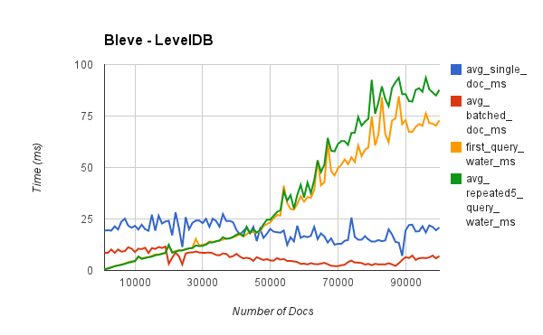

# bleve-bench

A utility for benchmarking bleve performance under various configurations and workloads.

The bleve-bench utility works by reading wikipedia articles from a previously generated file with a single article per line.  This minimizes time spent reading articles.

The tool performs a number of operations in a given level, and then prints out summary statistics about the performance in this level.  For example, with batch size 100 and level size 1000, it will:

1.  Load <batch size> documents individually
2.  Load batches of <batch size> until end of level
3.  Run term search for "water"
4.  Run <qrepeat - 1> term searches for "water"
5.  Print one CSV row for this level

The total execution time can be a useful metric, but this is not an attempt to load as many articles as possible as fast as possible.  Rather this tool is useful for seeing how the performance changes over time as the number of documents indexed grows.

## Output Format

```
elapsed,docs,avg_single_doc_ms,avg_batched_doc_ms,query_water_matches,first_query_water_ms,avg_repeated5_query_water_ms
```

## Running

		make wikilinefile

This will download the wikipedia dataset if you don't have it.  Then it will build the linefile utility.  Then it will run the linefile utility on the wikipedia dataset.

		./bleve-bench

## Usage

		Usage of ./bleve-bench:
		  -batch=100: batch size
		  -config="": configuration file to use
		  -count=100000: total number of documents to process
		  -cpuprofile="": write cpu profile to file
		  -level=1000: report level
		  -memprofile="": write memory profile every level
		  -qrepeat=5: query repeat
		  -source="tmp/enwiki.txt": wikipedia line file
		  -target="bench.bleve": target index filename

# Examples

Load 100000 articles, with all the defaults.

		./bleve-bench

Load 3000 articles using the leveldb backend and dump a cpu-profile at the end.

		./bleve-bench -config configs/leveldb.json -count 3000 -cpuprofile=leveldb.profile

Load 3000 articles using the leveldb backend and dump a memory profile after every level.

		./bleve-bench -config configs/leveldb.json -count 3000 -memprofile=leveldb-mem.profile

# Conclusions

What kind of conclusions can we draw from this utility?  Here is a chart produced using this utility to load 100k wikipedia documents into bleve.



This shows several important things:

1.  Indexing in a batch is faster than indexing individually.
2.  Indexing performance remained consistent as we added more and more documents.
3.  Term query time increases nearly linearly with respect to the number of documents matching the term.  The query behavior becomes more erratic and changes slope around 50k documents.
4.  The first query seems to perform better than the average of running the query five times.  This is surprising and warrants further exploration.